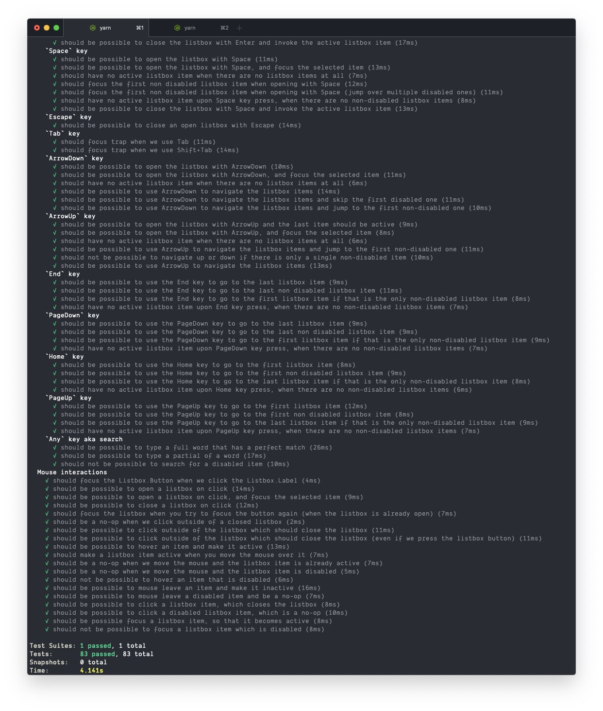

# HTML

## Semantisk HTML

Semantiska HTML-element är sådana element som beskriver vilken roll de har i dokumentet. De har sällan någon styling, men rekommenderas att använda istället för den vanliga `<div>`-taggen. Även om det mesta går att åstadkomma med icke-semantiska element som `<div>` och `<span>` finns det många fördelar med att tänka semantiskt:

- Förenkla för sökmotorer att förstå innehållet (bra för SEO)
- Göra det enklare att navigera för de som använder skärmläsare
- Göra det enklare för utvecklare att hitta i koden
- Förtydliga för utvecklare vilken typ av data som ska hanteras i olika delar av dokumentet


Exempel på semantiska HTML-element:
- `<section>`: En sektion i dokumentet som grupperar innehåll, ofta med en rubrik.
- `<article>`: En artikel, exempelvis ett foruminlägg, ett blogginlägg eller en nyhetsartikel.
- `<header>`: En container för introduktionsinnehåll och navigationslänkar. Kan ofta innehålla rubriker (`<h1>`-`<h6>`), logotyper eller ägarinformation.
- `<footer>`: En sektion i slutet av ett dokument eller sektion, som ofta innehåller ägarinformation, kontaktinformation, copyright, sitemaps, relaterade länkar m.m.
- `<nav>`: En container som innehåller navigationslänkar, t.ex. en meny. En skärmläsare kan exempelvis ignorera detta element vid en initial inladdning.
- `<aside>`: En sektion vars innehåll bara är indirekt relaterat till det huvudsakliga innehållet, exempelvis sidnoter och "fun facts".
- `<figure>` och `<figcaption>`: En container med självständigt innehåll, t.ex. illustrationer, diagram, foton m.m. En `<figcaption>` är en undertext i en `<figure>`.

### ⚠️ Undvik `<div>`-soppa

Nedan kommer ett bra exempel från [Stop using so many divs! An intro to semantic HTML](https://dev.to/kenbellows/stop-using-so-many-divs-an-intro-to-semantic-html-3i9i).

```html
<header> ✔️
    <h1>Super duper best blog ever</h1>
    <nav> ✔️
        <a href="/">Home</a>
        <a href="/about">About</a>
        <a href="/archive">Archive</a>
    </nav>
</header>
<main> ✔️
  <article> ✔️
    <header> ✔️
      <h1>Why you should buy more cheeses than you currently do</h1>
    </header>
    <section> ✔️
      <header> ✔️
          <h2>Part 1: Variety is spicy</h2>
      </header>
    </section>
    <section> ✔️
      <header> ✔️
          <h2>Part 2: Cows are great</h2>
      </header>
    </section>
  </article>
</main>
<footer> ✔️
  <section class="contact" vocab="http://schema.org/" typeof="LocalBusiness"> ✔️
    <h2>Contact us!</h2>
      <address property="email"> ✔️
        <a href="mailto:us@example.com">us@example.com</a>
      </address>
      <address property="address" typeof="PostalAddress">
        <p property="streetAddress">123 Main St., Suite 404</p>
        <p>
          <span property="addressLocality">Yourtown</span>,
          <span property="addressRegion">AK</span>,
          <span property="postalCode">12345</span>   
        </p>
        <p property="addressCountry">United States of America</p>
      </address>
  </section>
</footer>
```

## Interaktiva element och formulär

På ungefär samma sätt som det rekommenderas att använda semantiska element är det också rekommenderat att till största möjliga mån använda inbyggda HTML-element så som de är menade att användas. Även om allt tekniskt sätt går att åstadkomma med `<div>`-element och JavaScript om ambitionen finns, så får man mycket gratis om man använder det som redan tillhandahålls av HTML5:

- Funktionalitet kan fungera även när JavaScript är avstängt
- Skärmläsare förstår automatiskt hur olika element fungerar och vad de har för roll
- De olika elementen går att navigera med tangentbord på ett standardiserat sätt
- De olika elementen fungerar exakt så som användare förväntar sig, oavsett webbläsare
- De olika elementen fungerar exakt så som webbläsartillägg förväntar sig, exempelvis lösenordshanterare
- Man slipper lägga tid på att utveckla, testa och underhålla funktionalitet som redan finns

**Exempel på hur komplext det kan vara att korrekt återskapa funktionaliteten av ett inbyggt HTML-element (i detta fallet en `<select>`-dropdown):**


### ✔️ Använd `<form>`-elementet för formulär

Ett vanligt tillvägagångssätt är att stoppa sina textfält, dropdown-listor, checkrutor m.m. i en `<div>`-container, och sedan genom JavaScript lyssna efter ändringar i de olika formulärfälten, implementera egen fältvalidering, och skicka iväg datan som en HTTP-request när användaren klickar på en specifik knapp. Förutom att detta kan ta utvecklingstimmar så finns det många risker och fallgropar med detta:

- Formuläret går inte att använda när JavaScript är avstängt
- Det finns en risk att formuläret inte funkar i vissa webbläsare, exempelvis skärmläsare.
- Det kanske inte går att navigera formuläret på ett korrekt sätt, exempelvis att kunna skicka iväg formuläret genom att trycka på Enter.

**[Exempel med `<form>` och inbyggd fältvalidering:](https://jsfiddle.net/5tbnusfr/)**

```html
<form action="/api/register" method="post"> ✔️
  <fieldset>
    <legend>
      Har du ett körkort?<abbr title="Det här fältet är obligatoriskt">*</abbr>
    </legend>
    <label>
      Ja
      <input type="radio" required name="driversLicense" value="yes">
    </label>
    <label>
      Nej
      <input type="radio" required name="driversLicense" value="no">
    </label>
  </fieldset>
  <p>
    <label>
      Hur gammal är du?
      <input type="number" min="12" max="120" step="1" name="age">
    </label>
  </p>
  <p>
    <label>
      Vilken webbläsare använder du?
      <input list="browsers" name="browser">
    </label>
    <datalist id="browsers">
      <option value="Edge">
      <option value="Firefox">
      <option value="Chrome">
      <option value="Opera">
      <option value="Safari">
    </datalist>
  </p>
  <p>
    <label>
      Vad är din e-postadress?
      <input type="email" name="email">
    </label>
  </p>
  <p>
    <label>
      Något du vill tillägga?
      <br>
      <textarea name="message" maxlength="140" rows="5"></textarea>
    </label>
  </p>
  <p>
    <button>Skicka</button>
  </p>
</form>
```

### ✔️ Använd `<table>` för tabeller

Om du ska presentera data med rader och kolumner, använd det vanliga `<table>`-elementet. Det blir ofta lättare att skapa en snyggt linjerad tabell, och det brukar dessutom bli lättare för såväl seende som blinda att uppfatta datan.

**OBS: Använd inte `<table>` för icke-tabeller.** Under tidigt 2000-tal användes tabellelementet flitigt för att layouta sidelement, men det rekommenderas inte längre, och det finns idag effektivare och enklare sätt att layouta på. Dessutom gillas det inte alls av skärmläsare, då innehållet presenteras som data.

**[Exempel:](https://jsfiddle.net/xpn2b0t3/)**

```html
<table>
  <tr>
    <th>Förnamn</th>
    <th>Efternamn</th>
    <th>Redigera</th>
  </tr>
  <tr>
    <td>Vilgot</td>
    <td>Almén</td>
    <td><button>✎</button></td>
  </tr>
  <tr>
    <td>Irma</td>
    <td>Jacobsson</td>
    <td><button>✎</button></td>
  </tr>
</table>
```