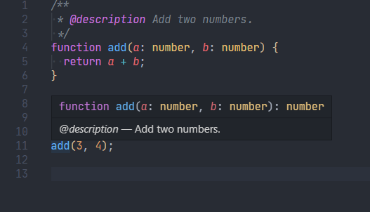
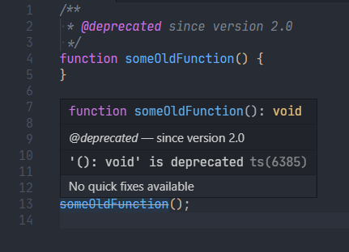
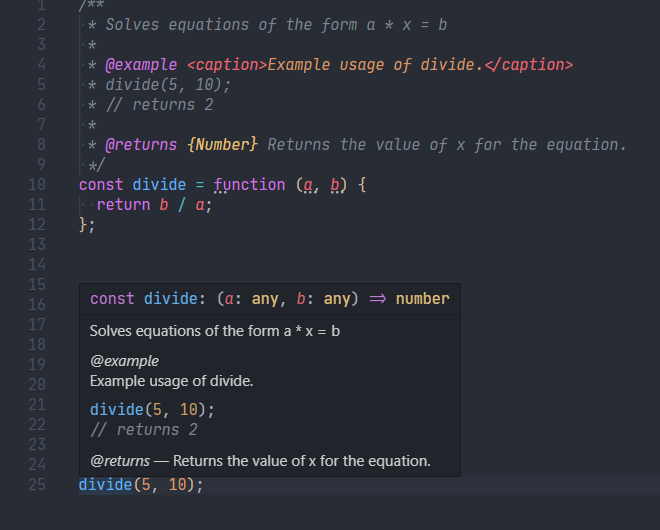
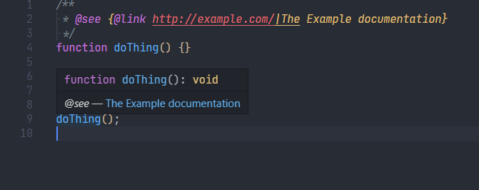
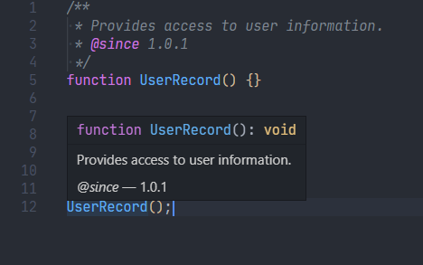
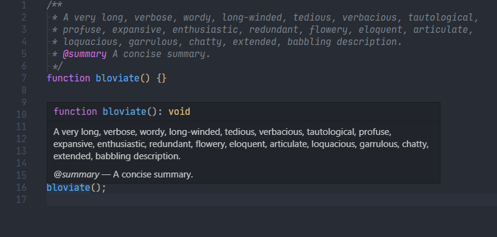
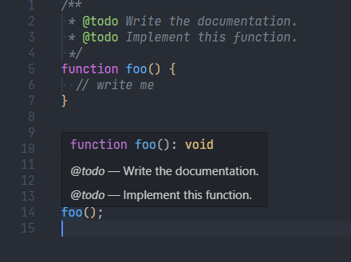
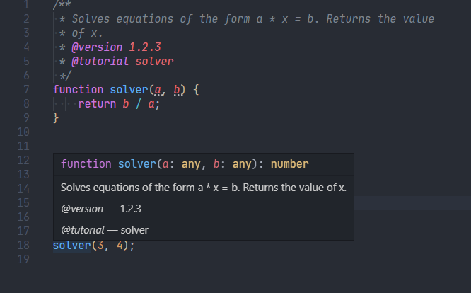
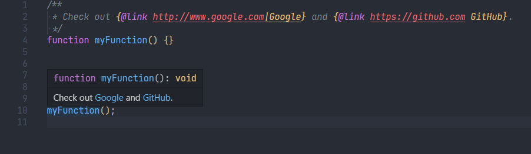

# JSDoc

## [@description](https://jsdoc.app/tags-description.html)

```javascript
/**
 * @description Add two numbers.
 */
function add(a: number, b: number) {
  return a + b;
}
```



## [@deprecated](https://jsdoc.app/tags-deprecated.html)

```javascript
/**
 * @deprecated since version 2.0
 */
function someOldFunction() {
}
```



## [@example](https://jsdoc.app/tags-example.html)

```javascript
/**
 * Solves equations of the form a * x = b
 *
 * @example <caption>Example usage of divide.</caption>
 * divide(5, 10);
 * // returns 2
 *
 * @returns {Number} Returns the value of x for the equation.
 */
const divide = function (a, b) {
  return b / a;
};
```



## [@see](https://jsdoc.app/tags-see.html)

```javascript
// Use the inline {@link} tag to include a link within a free-form description.
/**
 * @see {@link foo} for further information.
 * @see {@link http://github.com|GitHub}
 */
function bar() {}
```



## [@since](https://jsdoc.app/tags-since.html)

```javascript
/**
 * Provides access to user information.
 * @since 1.0.1
 */
function UserRecord() {}
```



## [@summary](https://jsdoc.app/tags-summary.html)

```javascript
/**
 * A very long, verbose, wordy, long-winded, tedious, verbacious, tautological,
 * profuse, expansive, enthusiastic, redundant, flowery, eloquent, articulate,
 * loquacious, garrulous, chatty, extended, babbling description.
 * @summary A concise summary.
 */
function bloviate() {}
```



## [@throws](https://jsdoc.app/tags-throws.html)

```javascript
/**
 * @throws {DivideByZero} Argument x must be non-zero.
 */
function baz(x) {}
```


## [@todo](https://jsdoc.app/tags-todo.html)

```javascript
/**
 * @todo Write the documentation.
 * @todo Implement this function.
 */
function foo() {
    // write me
}
```



## [@version](https://jsdoc.app/tags-version.html)

```javascript
/**
 * Solves equations of the form a * x = b. Returns the value
 * of x.
 * @version 1.2.3
 * @tutorial solver
 */
function solver(a, b) {
    return b / a;
}
```



## [{@link}](https://jsdoc.app/tags-inline-link.html)

```javascript
/**
 * See {@link MyClass} and [MyClass's foo property]{@link MyClass#foo}.
 * Also, check out {@link http://www.google.com|Google} and
 * {@link https://github.com GitHub}.
 */
function myFunction() {}
```


