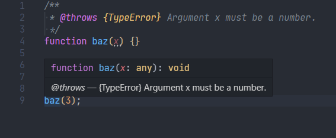

# JSDoc i TypeScript

JSDoc är ursprungligen ett system för att generera dokumentationer utifrån kodkommentarer. Det är fortfarande användbart i det syftet, men har också blivit en standard för att ange extra beskrivande information till JavaScript-objekt, och som editorverktyg för att snabbt kunna få upp information om olika objekt.

[JSDoc 3](https://jsdoc.app/index.html) har ungefär 65 officiella taggar, men det är värt att nämna att de flesta av taggarna är till för att specificera funktionalitet som saknas i äldre versioner av JavaScript, eller typinformation om man inte använder TypeScript. Eftersom vi rekommenderar att använda modern TypeScript (eller typad JavaScript - se [nedan](#jsdoc-i-javascript)) kommer vi att skippa överflödiga taggar så som `@class`, `@enum`, `@private`, `@readonly`, `@typedef` och dylikt som redan finns i språket. I den här sektionen kommer vi att nämna de JSDoc-taggar som är mest användbara i TypeScript.

Med det sagt är det ingen dum idé att [se vilka JSDoc-taggar som finns](https://jsdoc.app/index.html).

## [{@link}](https://jsdoc.app/tags-inline-link.html)

En inline-tagg som används för att infoga en länk i en JSDoc-text.

```javascript
/**
 * Check out {@link http://www.google.com|Google} and {@link https://github.com GitHub}.
 */
function myFunction() {}
```


## [@description](https://jsdoc.app/tags-description.html)

Beskriver ett objekt. Om det inte är helt självklart vad en funktion gör eller hur och när den ska användas, eller om det finns implementationsdetaljer som är viktiga att nämna, gör det gärna i denna beskrivning.

```javascript
/**
 * @description Add two numbers.
 */
function add(a: number, b: number) {
  return a + b;
}
```


Det går också att med fördel skippa taggen helt (om du inte använder en dokumentationsgenerator som verkar kräva det, exempelvis [TypeDoc](https://typedoc.org/).

```javascript
/**
 * Add two numbers.
 */
function add(a: number, b: number) {
  return a + b;
}
```


## [@deprecated](https://jsdoc.app/tags-deprecated.html)

Denna tagg markerar ett objekt som "deprecated" (utdaterad), som en varning om att det inte bör användas längre.

I VS Code syns detta visuellt genom en vit överstruken linje överallt där objektet används.

```javascript
/**
 * @deprecated since version 2.0
 */
function someOldFunction() {
}
```


## [@example](https://jsdoc.app/tags-example.html)

En av de mest tacksamma funktionaliteterna när det kommer till att använda JSDoc som ett kommentarsverktyg.

I `@example`-taggen kan man ange en kodsnutt av JavaScript/TypeScript som illustrerar hur en funktion ska användas. Om man hovrar musen över en funktionsreferens i VS Code så visas exempelkoden som formaterad, highlightad kod.

```javascript
/**
 * Solves equations of the form a * x = b
 *
 * @example <caption>Example usage of divide.</caption>
 * divide(5, 10);
 * // returns 2
 *
 * @returns {Number} Returns the value of x for the equation.
 */
const divide = function (a, b) {
  return b / a;
};
```


## [@see](https://jsdoc.app/tags-see.html)

Anger en länk till en URL där man kan läsa mer.

Detta är väldigt användbart om man t.ex. jobbar mot en dokumentation, eller om man följer implementationsdetaljer eller guidelines som anges någon annanstans.

```javascript
/**
 * @see {@link http://example.com|The Example documentation}
 */
function doThing() {}
```


## [@since](https://jsdoc.app/tags-since.html)

Anger i vilken app-version man införde ett specifikt objekt.

Detta är speciellt användbart om man skapar ett externt API, men kan också vara trevlig information internt i ett versionshanterat projekt.

```javascript
/**
 * Provides access to user information.
 * @since 1.0.1
 */
function UserRecord() {}
```


## [@summary](https://jsdoc.app/tags-summary.html)

Anges för att skriva en sammanfattad version av en längre beskrivning.

```javascript
/**
 * A very long, verbose, wordy, long-winded, tedious, verbacious, tautological,
 * profuse, expansive, enthusiastic, redundant, flowery, eloquent, articulate,
 * loquacious, garrulous, chatty, extended, babbling description.
 * @summary A concise summary.
 */
function bloviate() {}
```


## [@throws](https://jsdoc.app/tags-throws.html)

Eftersom TypeScript ännu inte har något sätt att annotera vilka exceptions en funktion kan kasta så kan `@throws`-taggen vara till nytta.

```javascript
/**
 * @throws {TypeError} Argument x must be non-zero.
 */
function baz(x) {}
```



## [@todo](https://jsdoc.app/tags-todo.html)

Används för att annotera uppgifter som inte ännu är gjorda.

En stark rekommendation, om du använder VS Code, är att installera extensionen [Todo Tree](https://marketplace.visualstudio.com/items?itemName=Gruntfuggly.todo-tree), och att ställa in den att använda strängen `@todo` som markör. På så sätt kommer varje JSDoc-`@todo` i projektet att samlas i ett och samma fönster, och kommer också att markeras med en tydlig färg i koden.

```javascript
/**
 * @todo Write the documentation.
 * @todo Implement this function.
 */
function foo() {
    // write me
}
```


## [@version](https://jsdoc.app/tags-version.html)

Anger vilket versionsnummer ett objekt har. Behöver nog sällan användas, men kan vara användbart om man exempelvis vill annotera ett API.

```javascript
/**
 * Solves equations of the form a * x = b. Returns the value of x.
 * @version 1.2.3
 * @tutorial solver
 */
function solver(a, b) {
    return b / a;
}
```


# JSDoc i JavaScript

En stor fördel med JSDoc är att det faktiskt kan användas tillsammans med TypeScript för att type-checka helt vanliga JavaScript-filer - helt utan kompilering.

## Installation

Öppna Visual Studio Code.

Installera senaste TypeScript-versionen:

```
npm install --save-dev typescript@latest
```

Lägg till detta i filen `tsconfig.json` (i projektets huvudmapp):

```json
{
  "compilerOptions": {
    "allowJs": true,
    "checkJs": true
  }
}
```

Det borde redan nu fungera med type-checking av JavaScript-filer. Testa annars att sätta VS Code-inställningen `"javascript.implicitProjectConfig.checkJs"` till `true`.

Som test kan spara denna kod som JavaScript och se om VS Code klagar på den felaktiga typningen nedan:

```javascript
/**
 * @type {number}
 */
const myNumber = 'Hello world!';
```

För att typ-checka din JavaScript från en terminal eller ett skript, åberopa TypeScript Compiler (`npx` behövs inte om det är ett package.json-skript):

```
npx tsc --noEmit
```

## Exempelanvändning

Nedan illustreras ett par exempel på hur JSDoc kan användas för dokumentation och typning. Det är inte nödvändigtvis de vackraste exemplen, men de visar exempel på ett par vanliga användningsområden.

### Skapa typdefinitioner och använda dem

```javascript
/**
 * @typedef {'admin' | 'editor' | 'reader'} UserRole
 */

/**
 * @typedef {Object} User
 * @property {number} age
 * @property {string} name
 * @property {UserRole} role
 * @property {User[]} connections
 */

/**
 * @type {User}
 */
const user = {
  age: 46,
  name: 'Frank',
  role: 'editor',
  connections: [
    {
      age: '41', // ⚠️ Type 'string' is not assignable to type 'number'. ts(2322)
      name: 'Amy',
      role: 'reader',
      connections: []
    }
  ]
};
```

### Importera typdefinitioner från andra filer/moduler

```javascript
/**
 * @typedef {import('./types.ts').User} User
 * @typedef {import('./server.js').ServerResponse} ServerResponse
 * @typedef {import('qs').IParseOptions} QueryStringParseOptions
 */
 
/** @type {User} */
const user = { name: 'Frank' };

/** @param {ServerResponse} res */
const requestHandler = (req, res) => {};

/** @type {QueryStringParseOptions} */
const qsOptions = { charset: 'utf-8' };
```

### Typa en funktion

```javascript
/**
 * Returns the base to the exponent power, that is, base^exponent.
 *
 * @param {number} base The base number.
 * @param {number} exponent The exponent used to raise the base.
 * @returns {number} A number representing the given base taken to the power of the given exponent.
 * @see https://developer.mozilla.org/en-US/docs/Web/JavaScript/Reference/Global_Objects/Math/pow
 */
const power = (base, exponent) => {
  return Math.pow(base, exponent);
};
```

### Typa en funktion med valfria parametrar

```javascript
/**
 * Creates a virtual HTML element node.
 *
 * @author Peter Parker
 * @module VirtualHTML
 * @since 0.2.0
 *
 * @typedef {Object.<string, number | string>} Attributes
 * @typedef {{ tagName: string; attributes: Attributes; childNodes: VChildNode[]; }} VElement
 * @typedef {{ data: string; }} VText
 * @typedef {VElement | VText} VChildNode
 *
 * @param {string} tagName
 * @param {Attributes} [attributes]
 * @param {VChildNode[]} [childNodes=[]]
 * @returns {VElement}
 */
const createVElement = (tagName, attributes, childNodes = []) => {
  return { tagName, attributes, childNodes };
};
```

### Typa en klass

```javascript
/**
 * A simple object for value storage/retrieval.
 * @typedef {Object.<string, *>} Store
 * @typedef {(value: *) => *} CustomGetter
 */
export class KeyValueStore {
  /**
   * The internal store object, which allows string-type keys and values of any type.
   * @type {Store}
   */
  #store = {};
  
  /**
   * An optional function that transforms the value before retrieval.
   * @type {CustomGetter}
   */
  customGetter;
  
  /**
   * @param {CustomGetter} customGetter
   */
  constructor(customGetter) {
    this.customGetter = customGetter;
  }
  
  /**
   * @param {string} key
   */
  get(key) {
    const value = this.#store[key];
    return this.customGetter
      ? this.customGetter(value)
      : value;
  }
  
  /**
   * @param {(key: string, value: *) => *} iteratee
   */
  forEach(iteratee) {
    for (const key in this.#store) {
      iteratee(key, this.#store[key]);
    }
  }
  
  /**
   * @param {string} key
   * @param {*} value
   */
  set(key, value) {
    this.#store[key] = value;
  }
}
```

### Casta ett värde från en typ till en subtyp

Genom att använda `/** @type ... */` med parenteser kring ett värde kan man casta värdet till en smalare typ.

**OBS:** Värdet *måste* ha parenteser `()` runt sig.

```javascript
/**
 * Creates a new blog post.
 * @typedef {{ content: string; timestamp: number; title: string; }} BlogPost
 * @param {import('express').Request} req
 * @param {import('express').Response} res
 * @param {string} req.params.postId The ID of the blog post.
 */
app.post('/Blog/:postId', async(req, res) => {
  try {
    /** @type {BlogPost} */
    const post = (req.body);
    BlogPosts.create(req.params.postId, post);
  } catch (ex) {
    res.status(500);
  }
  res.end();
});
```
