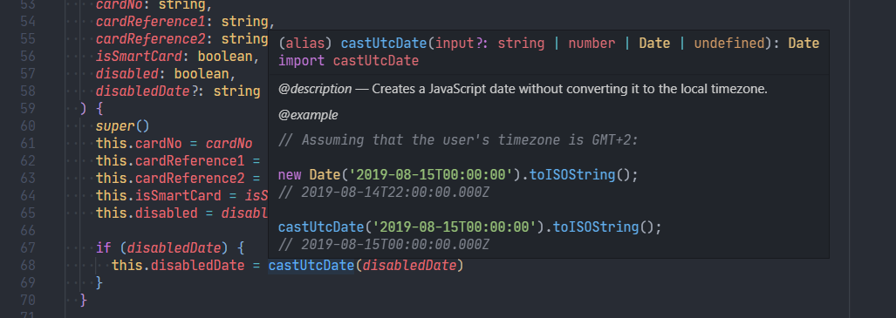

# Kodprinciper

## Single source of truth

Denna princip betyder att det bara ska finnas ett enda officiellt exemplar av den data du hanterar i en applikation. Om t.ex. en användares adress ändras någonstans i applikationen, ska det ha ändrats **överallt**, eftersom det bara finns ett officiellt objekt att referera till.

Om det bara finns en datakälla kan vi vara säker på att den data vi hanterar alltid är up-to-date.

```javascript
const usersById = {
  3527: {
    name: 'Frank',
    address: '3805 Romines Mill Road'
  }
}

const user = { ...usersById[3527] }; // ⚠️ VARNING: "{ ... }"-syntaxen skapar en kopia av användaren.
user.address = '1898 Rainbow Drive';

console.log(user.address);            // '1898 Rainbow Drive'
console.log(usersById[3527].address); // '3805 Romines Mill Road' ❌ (datan är nu ur synk)
```

```javascript
const usersById = {
  3527: {
    name: 'Frank',
    address: '3805 Romines Mill Road'
  }
}

const user = usersById[3527]; // ✔️ Så som JavaScript funkar så blir "user" en referens till officiella datakällan:
user.address = '1898 Rainbow Drive';

console.log(user.address);            // '1898 Rainbow Drive'
console.log(usersById[3527].address); // '1898 Rainbow Drive' ✔️
```

## DRY (Don't Repeat Yourself)

Denna princip handlar om att aldrig skriva samma, eller liknande, kod två gånger. På så sätt 

### ✔️ Använd konstanter istället för hårdkodade värden

Om du behöver använda samma hårdkodade värde mer än en gång, definiera det som en konstant.

Det gör det dels lätt att uppdatera värdet överallt det används...

```javascript
// db.js
const USERS_TABLE = 'Users';

❌ knex('Users').update({ email: user.email }).where({ id: user.id });
✔️ knex(USERS_TABLE).update({ email: user.email }).where({ id: user.id });

// server.js
❌ app.listen(3000);
✔️ app.listen(process.env.PORT);
```

...men också enkelt att förstå vad värdet betyder:

```javascript
// cookies.js
const COOKIE_EXPIRY_MS = 15 * 60 * 1000; // The cookie should expire after 15 minutes.

❌ Cookie.save('token', token, { expires: new Date(Date.now() + 900000) });
✔️ Cookie.save('token', token, { expires: new Date(Date.now() + COOKIE_EXPIRY_MS) });

// filesystem.js
const ERROR_PERMISSION_DENIED = 'OACCES';

❌ if (error.code === 'OACCES') {}
✔️ if (error.code === ERROR_PERMISSION_DENIED) {}
```

Om dina hårdkodade värden kan ha ett av ett fördefinierat antal värden, använd gärna en enumerering (`enum` i TypeScript, eller ett vanligt objekt i JavaScript).

```typescript
// app.ts
const enum MouseButton {
  LEFT = 0,
  MIDDLE = 1,
  RIGHT = 2,
  BACK = 3,
  FORWARD = 4
}

❌ if (event.button === 0) {}
✔️ if (event.button === MouseButton.LEFT) {}

// server.js
const { StatusCodes } = require('http-status-codes');

❌ res.status(403).end();
✔️ res.status(StatusCodes.FORBIDDEN).end();
```

### ✔️ Skapa högre funktioner istället för att duplicera liknande kod

Detta gör det enklare att underhålla och hantera kod, när all logik är på samma ställe.

Gör inte exempelvis detta:

```javascript
// Form.ts
❌ handleEmailUpdate = (event: React.ChangeEvent) => {
  const value = event.target.value;
  this.setState({ email: value });
}

❌ handleFullNameUpdate = (event: React.ChangeEvent) => {
  const value = event.target.value;
  this.setState({ fullName: value });
}

❌ handlePasswordUpdate = (event: React.ChangeEvent) => {
  const value = event.target.value;
  this.setState({ password: value });
}

...

<input onChange={❌ this.handleEmailUpdate} name="email" type="email" />
<input onChange={❌ this.handleFullNameUpdate} name="fullName" type="text" />
<input onChange={❌ this.handlePasswordUpdate} name="password" type="password" />
```

Gör istället detta:

```javascript
// Form.ts
✔️ handleInputUpdate(event: React.ChangeEvent) {
  const name = event.target.name;
  const value = event.target.value;
  this.setState({ [name]: value });
}

...

<input onChange={✔️ this.handleInputUpdate} name="email" type="email">
<input onChange={✔️ this.handleInputUpdate} name="fullName" type="text">
<input onChange={✔️ this.handleInputUpdate} name="password" type="password">
```

## Kommentera bara i koden som sista utväg


### ❌ Undvik att använda kommentarer för att splitta upp kodblock

```javascript
app.post('/login', (req, res) => {
  // Validate headers to prevent CSRF (cross-site request forgery):
  if (req.header('X-Requested-With') !== 'XmlHttpRequest') {
    return res.status(StatusCode.BAD_REQUEST).end('Received malformed request.');
  }
  
  // Validate form:
  if (!validator.email(req.body.email)) {
    return res.status(StatusCode.BAD_REQUEST).end(`Invalid email: ${req.body.email}`);
  } else if (!validator.string(req.body.name)) {
    return res.status(StatusCode.BAD_REQUEST).end(`Invalid username: ${req.body.name}`);
  }
  
  // Validate password:
  const user = await getUserFromEmail(req.body.email);
  const isValidPassword = await bcrypt.compare(req.body.password, user.passwordHash);
  if (!isValidPassword) {
    return res.status(StatusCode.FORBIDDEN).end('Invalid password.')
  }
  
  // Create access token:
  const accessToken = await JWT.signAccessToken(user);
  
  // Login user:
  return res.cookie('access_token', accessToken, CookieOptions).end('Success!');
});
```

Splitta hellre upp koden i tydligt namngivna, återanvändbara funktioner:

```javascript
app.post('/login', ✔️ validateCsrfHeader, (req, res) => {
  try {
    const user = ✔️ await validateAndGetUser(req.body);
    const accessToken = ✔️ await createAccessToken(user);
    return res.cookie('access_token', accessToken, CookieOptions).end('Success');
  } catch (error) {
    return res.status(error.statusCode).end(error.message);
  }
});
```

### ❌ Undvik att använda kommentarer för att beskriva vad specifika kodrader gör

```javascript
// Handle when the "Open file..." button has been clicked:
onClick = (event: React.MouseEvent) = {
  // If it's a left click:
  if (event.button === 0) {
    // Show the file selection modal:
    // A value of 1 means that the modal should have a close button.
    show(1);
  }
}
```

Använd istället konstanter och tydliga variabelnamn genomgående:

```javascript
handleOpenFileButtonClick = (event: React.MouseEvent) => {
  if (event.button === MouseButton.LEFT) {
    showOpenFileModal({ exitButton: true });
  }
}
```

### ✔️ Använd kommentarer för att förtydliga designbeslut som inte annars är uppenbara

```javascript
// Their API only returns 25 results at a time, so we might have to do multiple requests:
while (hasMore) {
  const response = await fetch(`${API_URL}/posts?page=${page}`);
  if (response.ok) {
    posts.push(await response.json());
    hasMore = response.headers.get('x-pagination-hasmore');
    page++;
  }
}
```

### ✔️ Använd JSDoc-kommentarer för att beskriva och annotera funktioner

Det ursprungliga syftet med JSDoc är att kunna generera dokumentation utifrån kommentarsblock i koden, men det finns fler fördelar än så. Dels blir JSDoc-kommentarer snyggt formaterade och färglagda i editorn, men dels kan man hålla musen över en kodreferens var som helst i koden och snabbt ta till sig av dess dokumentation på ett smidigt sätt.

Läs mer i **[JSDoc-guiden](./JSDoc.md)**.

```typescript
const MS_PER_MINUTE = 60_000;

/**
 * @description
 * Creates a JavaScript date without converting it to the local timezone.
 *
 * @example
 * // Assuming that the user's timezone is GMT+2:
 *
 * new Date('2019-08-15T00:00:00').toISOString();
 * // 2019-08-14T22:00:00.000Z
 *
 * castUtcDate('2019-08-15T00:00:00').toISOString();
 * // 2019-08-15T00:00:00.000Z
 */
export const castUtcDate = (input?: number | string | Date): Date => {
  const date = input ? new Date(input) : new Date();
  const userTimezoneOffset = date.getTimezoneOffset() * MS_PER_MINUTE;
  return new Date(date.getTime() - userTimezoneOffset);
};
```



## Modulär kod

Kod är lättare att underhålla och resonera kring om den är ***modulär***. Modulär kod i denna betydelse betyder att den kan helt brytas ut ur sin kontext och fortfarande fungera som den ska. Perfekt modulär kod kan således betraktas som en samling självständiga byggstenar; och motsatsen kan ungefär ses som svårhanterad [spaghettikod](https://en.wikipedia.org/wiki/Spaghetti_code), där de olika delarna refererar hejvilt till varandra.

Modularitet går att nå på flera nivåer (exempel):
- **En [ren funktion](https://en.wikipedia.org/wiki/Pure_function)**, som alltid returnerar samma värde om man matar in samma parametrar, och inte påverkar någonting utanför funktionen.
- **En fil, en klass, eller en funktionssamling**, som bara har rena funktioner eller funktioner som påverkar sig själv, men som inte behöver någon kännedom om kontexten utanför.
- **En mapp** som kan flyttas från ett projekt till ett annat och fortfarande fungera som den ska. Den behöver alltså ingen kännedom om filerna utanför.
- **En modul, ett bibliotek eller ett ramverk**, som kan importeras i sin helhet utan att man behöver förlita så på att något annat finns installerat.

### ⚠️ Undvik globala variabler och dynamiska variabler på filnivå

```javascript
// map.js
const STYLE_URL = 'mapbox://styles/mapbox/streets-v11';

❌ window.hasMapLoaded = false;

⚠️ const map = new mapboxgl.Map({
  container: 'map',
  style: STYLE_URL,
  center: [-74.5, 40],
  zoom: 9
});

⚠️ let marker = null;

export const setMarker = (lngLat) => {
  marker = mapboxgl.Marker()
    .setLngLat(lngLat)
    .addTo(map);
}
```

✔️ Använd gärna en klass eller ett klassliknande objekt som innehåller all state. På så sätt är "Map" en egen modul, istället för att hela filen är en modul (vilket ofta är svårare att jobba med).

```javascript
// map.js
const STYLE_URL = 'mapbox://styles/mapbox/streets-v11';

✔️ export class Map {
  constructor() {
    this.map = new mapboxgl.Map({
      container: 'map',
      style: STYLE_URL,
      center: [-74.5, 40],
      zoom: 9
    });
    ✔️ this.marker = null;
    ✔️ this.hasLoaded = false;
  }
  
  setMarker(lngLat) {
    this.marker = new mapboxgl.Marker()
      .setLngLat(lngLat)
      .addTo(map);
  }
}
```

### ✔️ Skicka hellre ned data än att hämta den från ovan

```typescript
// ./app.ts
import './backend/server';

// ./backend/server.ts
import { Config } from '../Config'; // ⚠️ Mappen "backend" förlitar sig nu på kontexten utanför.
import server from '@some-server';

server.listen(Config.PORT);
```

✔️ Skicka gärna med data nedåt:

```typescript
// ./app.ts
import { Config } from './Config';
import { startServer } from './backend/server';

// ✔️ Appen skickar med den data som behövs, så "backend"-mappen är kontextfri:
startServer(Config.PORT);

// ./backend/server.ts
import server from '@some-server';

export const startServer = (port: number) => {
  server.listen(port);
}
```

**OBS:** Var dock rimligt med detta. Ibland behöver man skicka runt data genom väldigt många funktioner, och då kan det bli mer lättläst på andra sätt:
  - **Ett dataobjekt**. Istället för att skicka med exempelvis `age`, `email`, `name` osv. överallt kan du exempelvis kan skicka vidare objektet `user` som innehåller all den datan.
  - **Extern state**, exempelvis tekniker som **React Hooks**, **Redux**, **Vuex**, **MobX**.
  - **En fil som exporterar ett objekt**. Om du vet att det alltid kommer finnas exakt *ett* exemplar av datan ifråga, så kan du ha det i en separat fil som kan importeras varifrån som helst. `require(...)` och `import ...` kommer alltid returnera en live-version av det exporterade objektet. Använd detta sparsamt.

### ✔️ Håll sammankopplad kod i samma mapp

Detta är något jag (Robin) har blivit varse med på senare tid. Det blir väldigt lättarbetat om man låter enskilda mappar vara isolerade moduler.

⚠️ Undvik detta:

```
/app
  /tests
    /database.test.ts ⚠️
    /server.test.ts ⚠️
  /types
    /database.d.ts ⚠️
    /server.d.ts ⚠️
  /database.ts
  /server.ts
```

✔️ Gör gärna detta:

```
/app
  /database ✔️
    /database.ts
    /database.d.ts
    /database.test.ts
  /server ✔️
    /server.ts
    /server.d.ts
    /server.test.ts
```
